# Dual-Stage Loan Risk Prediction System

An imbalance-aware dual-stage loan risk prediction system built using machine learning, ensemble learning, and explainable AI techniques.

---

# Project Overview

This project implements a complete machine learning workflow for loan risk prediction using the Lending Club dataset from Kaggle.

The system is divided into two stages:

### 1. Pre-Loan Eligibility Assessment
Predicts whether a borrower is likely to be eligible before loan approval using applicant-related financial features.

### 2. Post-Loan Default Risk Monitoring
Predicts the probability of loan default after loan issuance using advanced ensemble learning techniques.

Key focus areas include:
- Class imbalance handling
- Ensemble learning
- Feature selection
- Explainable AI using SHAP
- End-to-end inference pipeline using serialized models

---

# Key Features

- Dual-stage loan risk prediction system
- Imbalance-aware machine learning workflow
- Ensemble learning using Voting and Stacking
- Feature selection pipeline
- SHAP explainability analysis
- Serialized deployment-ready models
- End-to-end inference pipeline

---

# Dataset

- Source: Lending Club Dataset
- Platform: Kaggle
- Dataset Sample Used: ~100,000 loan records

---

# Workflow Pipeline

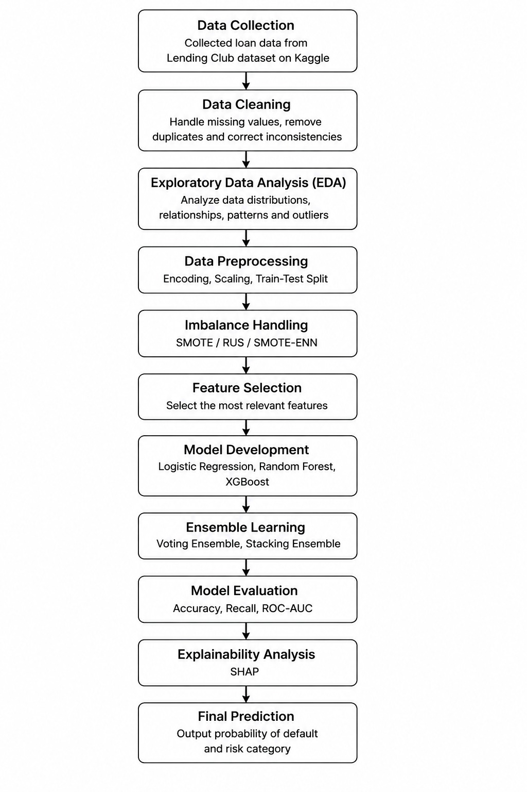

---

# Machine Learning Workflow

```text
Data Collection
      ↓
Data Cleaning
      ↓
Exploratory Data Analysis (EDA)
      ↓
Data Preprocessing
(Encoding, Scaling, Train-Test Split)
      ↓
Imbalance Handling
(SMOTE / RUS / SMOTE-ENN)
      ↓
Feature Selection
      ↓
Model Development
(Logistic Regression, Random Forest, XGBoost)
      ↓
Ensemble Learning
(Voting Ensemble, Stacking Ensemble)
      ↓
Model Evaluation
(Accuracy, Recall, ROC-AUC)
      ↓
Explainability Analysis
(SHAP)
      ↓
Final Prediction
```

---

# Models Used

## Pre-Loan Eligibility Prediction
- Logistic Regression

## Post-Loan Default Prediction
- Random Forest
- XGBoost
- Voting Ensemble
- Stacking Ensemble (Final Model)

---

# Imbalance Handling Techniques

The project evaluates multiple class imbalance handling methods:

- Random Under Sampling (RUS)
- SMOTE
- SMOTE-ENN

---

# Class Distribution Before Imbalance Handling

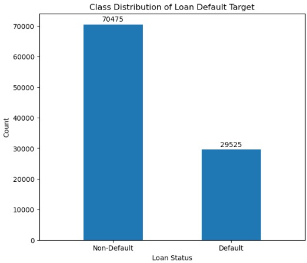

---

# Final Deployment Models

## Pre-Loan Model
- Logistic Regression

## Post-Loan Model
- Stacking Ensemble

### Base Models
- Random Forest
- XGBoost

### Meta Learner
- Logistic Regression

---

# Model Evaluation Metrics

The models were evaluated using:

- Accuracy
- Recall
- ROC-AUC Score

---

# Model Comparison Results

## Accuracy Comparison

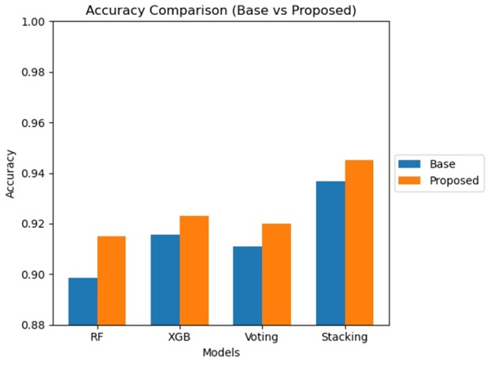

---

## Recall Comparison

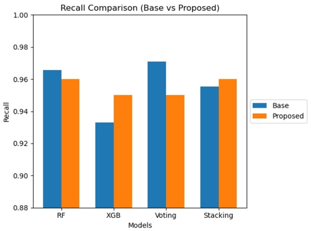

---

## ROC-AUC Comparison

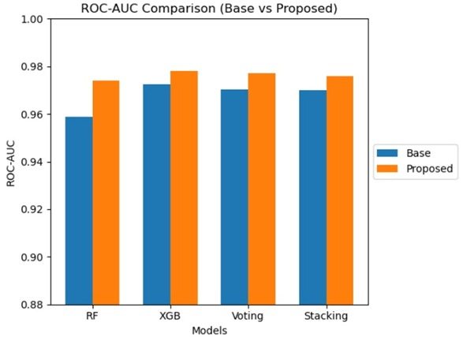

---

## Combined Model Metrics

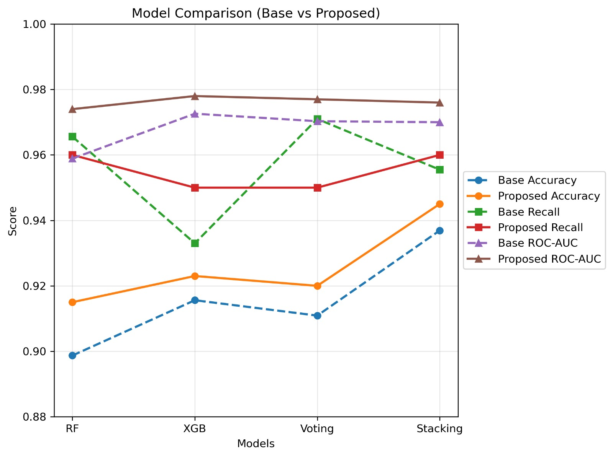

---

# Sampling Technique Comparisons

## Recall Comparison

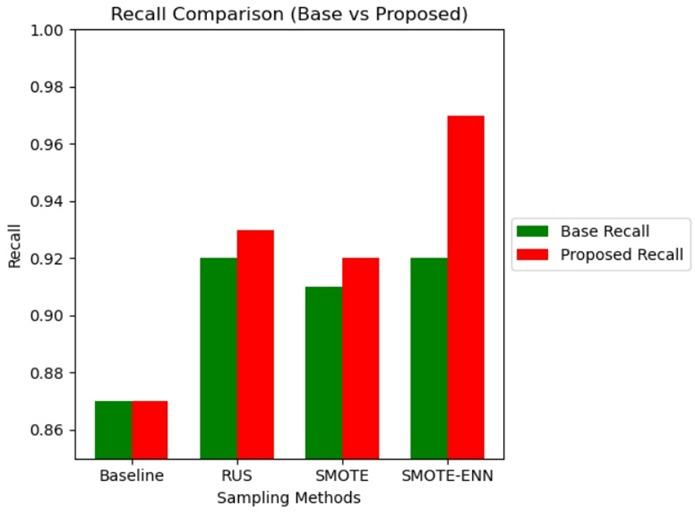

---

## ROC-AUC Comparison

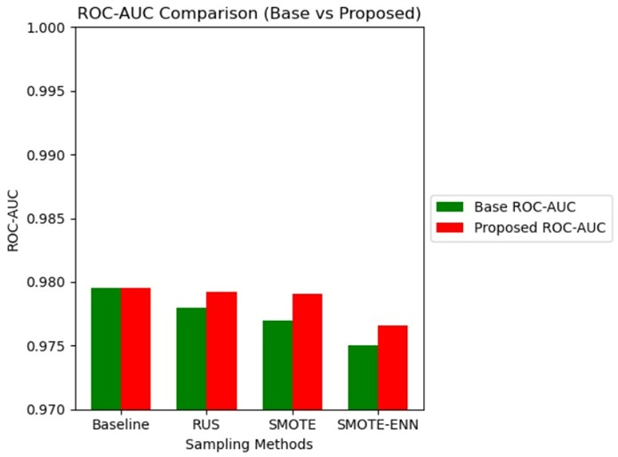

---

## Combined Sampling Metrics

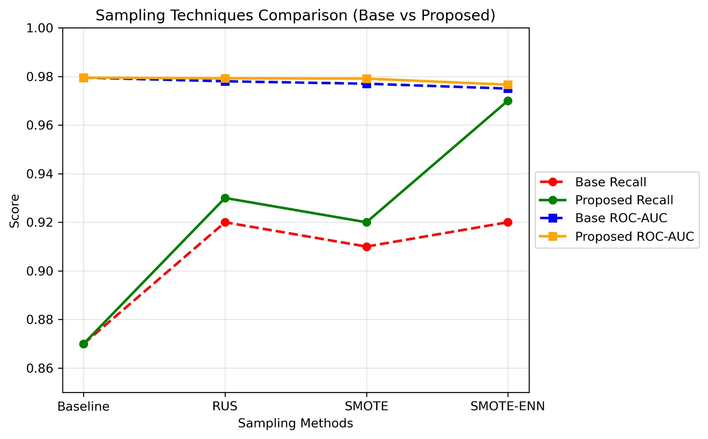

---

# Comparison Tables

## Model Comparison Table

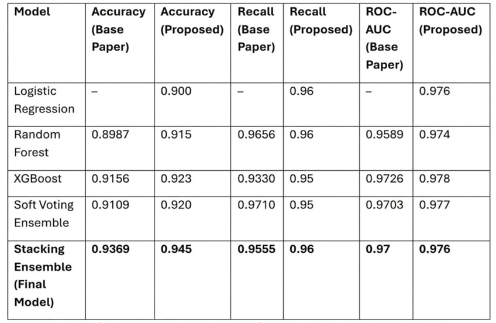

---

## Sampling Comparison Table

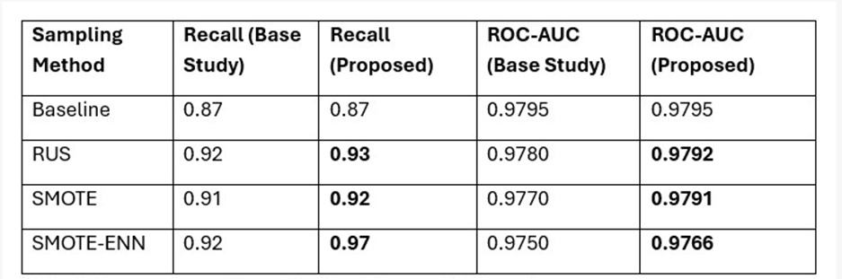

---

# Explainability Using SHAP

SHAP (SHapley Additive exPlanations) was used to interpret model predictions and identify the most influential features contributing to loan default risk.

SHAP was used to analyze feature contributions for post-loan default predictions generated by the stacking ensemble workflow.

The explainability workflow is demonstrated in:

```text
06_postloan_inference_and_shap.ipynb
```

---

# Project Structure

```text
dual-stage-loan-risk-prediction/
│
├── images/
│
├── models/
│   ├── postloan/
│   │   ├── final_stacking_model.pkl
│   │   ├── preprocessing_pipeline.pkl
│   │   ├── raw_feature_columns.pkl
│   │   └── selected_feature_indices.pkl
│   │
│   └── preloan/
│       └── eligibility_lr.pkl
│
├── notebooks/
│   ├── 01_data_preprocessing.ipynb
│   ├── 02_feature_selection.ipynb
│   ├── 03_imbalance_handling.ipynb
│   ├── 04_ensemble_models.ipynb
│   ├── 05_preloan_prediction.ipynb
│   └── 06_postloan_inference_and_shap.ipynb
│
├── requirements.txt
├── .gitignore
└── README.md
```

---

# Inference Pipeline

The post-loan prediction workflow follows:

```text
Raw Borrower Input
        ↓
Preprocessing Pipeline
        ↓
Feature Selection
        ↓
Stacking Ensemble Prediction
        ↓
Probability of Default
        ↓
Risk Category
```

---

# Risk Categories

| Probability Range | Risk Category |
|---|---|
| < 0.30 | Low Risk |
| 0.30 – 0.60 | Medium Risk |
| > 0.60 | High Risk |

---

# Installation

Clone the repository:

```bash
git clone 
```

Move into the project directory:

```bash
cd dual-stage-loan-risk-prediction
```

Create virtual environment:

```bash
python -m venv .venv
```

Activate environment:

### Windows
```bash
.venv\Scripts\activate
```

### Linux / Mac
```bash
source .venv/bin/activate
```

Install dependencies:

```bash
pip install -r requirements.txt
```

---

# Future Improvements

- Deploy model using Streamlit or Flask
- Hyperparameter optimization
- Build interactive loan risk dashboard
- Add real-time prediction API
- Integrate database support
- Improve explainability visualization

---

# Author

K Mallikarjun

---
